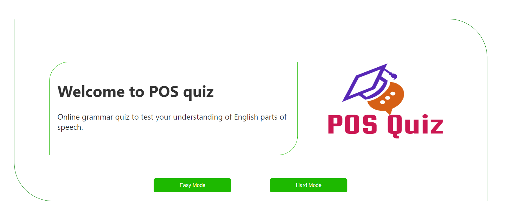
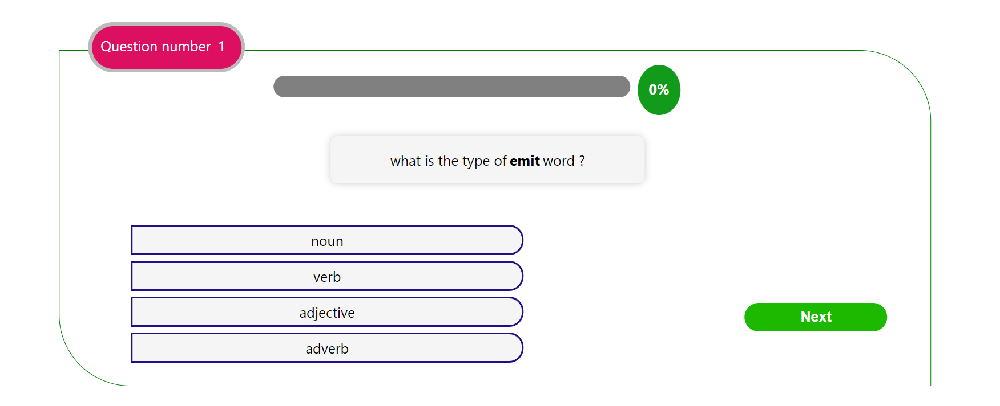
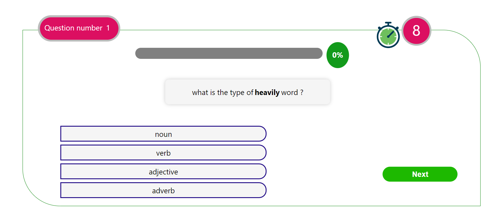
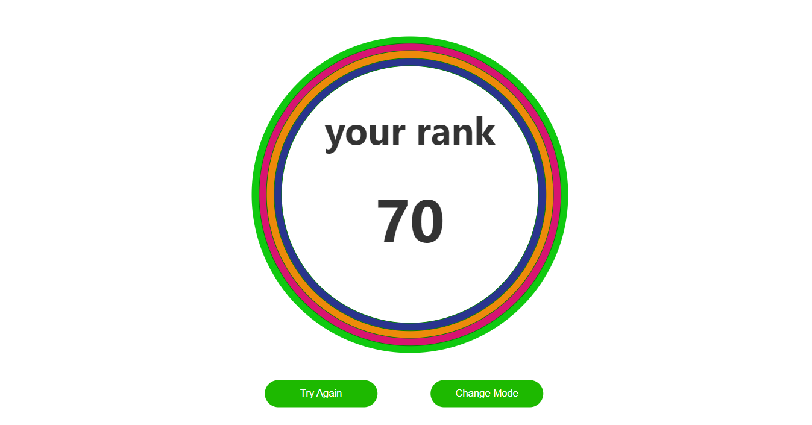

# Part-of-speech-quiz
Online grammar quiz to test your understanding of English parts of speech.

## Description:
The quiz has 2 modes 
- Easy mode:
The user needs to think and answer the question with no limitation in time or penality in the wrong answer. 
- Hard mode: 
The user has only 10 seconds to answer the question or the application skip this question, and if the user's answer was wrong he/she would get penality in the score.


## installation 
- clone the repository 
  ```sh
     git clone https://github.com/ahmedgalal98/Part-of-speech-quiz.git
     ```
- Install dependencies
    ```sh
     npm i
     ```
- run server side 
    ```sh
     nodemon server.js
     ```
- run client side 
    ```sh
     npm start
     ```


## Screenshots:


- Easy Mode  

- Hard Mode 

- Rank Screen 


